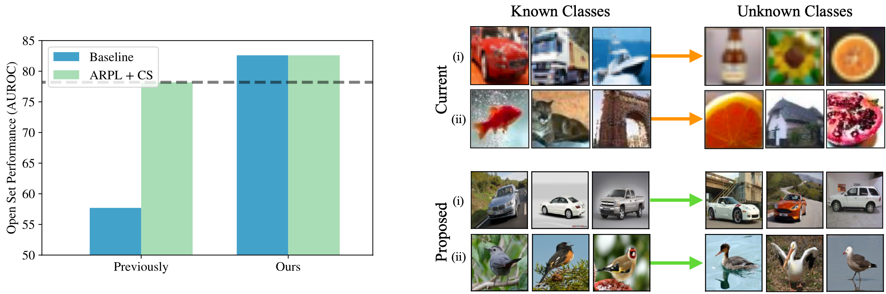

# Open-Set Recognition: A Good Closed-Set Classifier is All You Need
Code for our paper: [Open-Set Recognition: A Good Closed-Set Classifier is All You Need](https://arxiv.org/abs/2110.06207)

> **Abstract:** *The ability to identify whether or not a test sample belongs to one of the semantic classes in a classifier's training set is critical to
practical deployment of the model. This task is termed open-set recognition (OSR) and has received significant attention in recent years. In this paper, we 
>first demonstrate that the ability of a classifier to make the 'none-of-above' decision is highly correlated with its accuracy on the closed-set classes. We find that this relationship holds across loss objectives and architectures, and further demonstrate the trend both on the standard OSR benchmarks as well as on a large-scale ImageNet evaluation. Second, we use this correlation to boost the performance of the cross-entropy OSR 'baseline' by improving its closed-set accuracy, and with this strong baseline achieve a new state-of-the-art on the most challenging OSR benchmark. Similarly, we boost the performance of the existing state-of-the-art method by improving its closed-set accuracy, but this does not surpass the strong baseline on the most challenging dataset. Our third contribution is to reappraise the datasets used for OSR evaluation, and construct new benchmarks which better respect the task of detecting semantic novelty, as opposed to low-level distributional shifts as tackled by neighbouring machine learning fields. In this new setting, we again demonstrate that there is negligible difference between the strong baseline and the existing state-of-the-art.*



## Running

### Dependencies

```
pip install -r requirements.txt
```

### Datasets

A number of datasets are used in this work, many of them can be downloaded directly through PyTorch servers:
* Standard Benchmarks: [MNIST](https://pytorch.org/vision/stable/datasets.html),
[SVHN](https://pytorch.org/vision/stable/datasets.html),
[CIFAR-10/100](https://pytorch.org/vision/stable/datasets.html),
[TinyImageNet](https://github.com/rmccorm4/Tiny-Imagenet-200)
* Proposed Benchmarks: [ImageNet-21K-P](https://github.com/Alibaba-MIIL/ImageNet21K),
 [CUB](http://www.vision.caltech.edu/visipedia/CUB-200.html),
[FGVC-Aircraft](https://www.robots.ox.ac.uk/~vgg/data/fgvc-aircraft/)

**Open-set Splits**:

For the proposed open-set benchmarks, the directory ```data/open_set_splits``` contains the proposed class splits
 as ```.pkl``` files. For the FGVC datasets, the files also include information on which
 open-set classes are most similar to which closed-set classes.

### Config

Set paths to datasets and pre-trained models (for fine-grained experiments) in ```config.py```

Set ```SAVE_DIR``` (logfile destination) and ```PYTHON``` (path to python interpreter) in ```bash_scripts``` scripts.

### Run

To recreate results on TinyImageNet (Table 1). Our runs give us 82.60% AUROC for both
(ARPL + CS)+ and Cross-Entropy+.

```
bash bash_scripts/osr_train_tinyimagenet.sh
```

### Optimal Hyper-parameters:

We tuned label smoothing and RandAug hyper-parameters to optimise **closed-set** accuracy on a single random validation
split for each dataset. For other hyper-parameters (image size, batch size, learning rate) we took values from 
the open-set literature for the standard datasets (specifically, the ARPL paper) and values from the FGVC literature
for the proposed FGVC benchmarks.

**Cross-Entropy optimal hyper-parameters:**

| **Dataset**       | **Image Size** | **Learning Rate** | **RandAug N** | **RandAug M** | **Label Smoothing** | **Batch Size** |
|---------------|------------|---------------|-----------|-----------|-----------------|------------|
| MNIST         | 32         | 0.1           | 1         | 8         | 0.0             | 128        |
| SVHN          | 32         | 0.1           | 1         | 18        | 0.0             | 128        |
| CIFAR-10      | 32         | 0.1           | 1         | 6         | 0.0             | 128        |
| CIFAR + N     | 32         | 0.1           | 1         | 6         | 0.0             | 128        |
| TinyImageNet  | 64         | 0.01          | 1         | 9         | 0.9             | 128        |
| CUB           | 448        | 0.001         | 2         | 30        | 0.3             | 32         |
| FGVC-Aircraft | 448        | 0.001         | 2         | 15        | 0.2             | 32         |

**ARPL + CS optimal hyper-parameters:**

(Note the lower learning rate for TinyImageNet)

| **Dataset**       | **Image Size** | **Learning Rate** | **RandAug M** | **RandAug N** | **Label Smoothing** | **Batch Size** |
|---------------|------------|---------------|-----------|-----------|-----------------|------------|
| MNIST         | 32         | 0.1           | 1         | 8         | 0.0             | 128        |
| SVHN          | 32         | 0.1           | 1         | 18        | 0.0             | 128        |
| CIFAR10      | 32         | 0.1           | 1         | 15         | 0.0             | 128        |
| CIFAR + N     | 32         | 0.1           | 1         | 6         | 0.0             | 128        |
| TinyImageNet  | 64         | 0.001          | 1         | 9         | 0.9             | 128        |
| CUB           | 448        | 0.001         | 2         | 30        | 0.2             | 32         |
| FGVC-Aircraft | 448        | 0.001         | 2         | 18        | 0.1             | 32         |

### Other

This repo also contains other useful utilities, including:
 * ```utils/logfile_parser.py```: To directly parse ```stdout``` outputs for Accuracy / AUROC metrics
 * ```data/open_set_datasets.py```: A useful framework for easily splitting existing datasets into controllable open-set splits
  into ```train```, ```val```, ```test_known``` and ```test_unknown```. Note: ImageNet has not yet been integrated here.
 * ```utils/schedulers.py```: Implementation of Cosine Warm Restarts with linear rampup as a PyTorch learning rate scheduler
  
## Citation

If you use this code in your research, please consider citing our paper:
```
@article{vaze21openset,
    author  = {Sagar Vaze and Kai Han and Andrea Vedaldi and Andrew Zisserman},
    title   = {Open-Set Recognition: A Good Closed-Set Classifier is All You Need},
    journal = {arXiv preprint arXiv:2110.06207},
    year    = {2021},
  }
```

Furthermore, please also consider citing
 [Adversarial Reciprocal Points Learning for Open Set Recognition](https://github.com/iCGY96/ARPL), upon whose code we build this repo.
